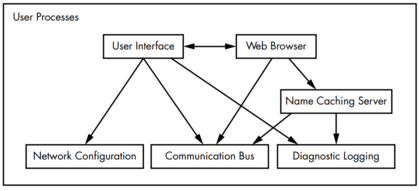

## Chapter 1 - The Big Picture
A linux system is abstracted to 3 layers (highest to lowest):
* **User processes** - GUI, servers, shell, web browsers
* **Linux kernel** - System calls, Process management, memory management, device drivers
* **Hardware** - CPU, RAM, Disks, Network Ports

Code that runs in `kernel mode` has unrestricted access to the CPU and memory of the system.
Where as in `user mode`, processes only have access to a small subset of memory and safe CPU operations.

A `memory state` is just an arrangement of bits with a certain bit field.

The kernel divides up the system memory and distributes it among user processes, it ensures that each process doesn't exceed it's share.

The kernel manages tasks for the following system areas:
* **Processor** - decides which processes are allowed to use the CPU and the CPU operations allowed.
	- Each process has a `time slice` (time allowed to use the CPU), when that time is up the kernel performs a `context switch` - the process of giving up control of the CPU for the next process to use. This gives the illusion that multiple processes are running simultaneously.
	- The kernel runs through its tasks between the `time slices` of processes during a `context switch`.
* **Memory** - keeps track of the memory in use, shared and unused by all processes.
	- The kernel manages memory such that: the kernel has it's own private memory, user processes have their own section, processes can't access another's private memory but can shared if allowed, may be read only in some processes, limit can be exceeded by using disk space.
	- CPUs have a Memory Management Unit where memory is set up as `virtual memory`, this prevents user processes from accessing memory directly, instead the kernel manages it through a memory address map.
* **Device drivers** - interfaces between the hardware and the processes.
	- Device drivers are a part of the kernel so that there can be a uniform interface for different devices but with the same functionality (like two network cards).
* **System calls and support** - for a process to talk to the hardware, it must make a system call to the kernel.
	- System calls are used because processes may not be able to do kernel specific tasks like opening, reading, writing as well as things like `fork()` and `exec(program)`.
	- `fork()`: kernel creates a copy of the process.
	- `exec(program)`: kernel loads and starts `program` and replaces the current process.
	- `pseudodevices` are a kernel feature where processes think they are devices except they are implemented purely in software, generally within the kernel (like `/dev/random`).

`User space` is the main memory allocted by the kernel for user processes and also refers to the memory for all running processes. Example of how some components interact on a Linux system within user space:

  

A `user` can run processes and own files, as well have a username where the kernel recognises users via a `user id`. Every process has an `owner` and they run with the permissions of the owner. Users can modify or end processes they are the owner of and not other processes of other users.

The `root` user (or `super user`) is an administrator of the system, they can end or modify any user's processes as well as access any file on the system.
